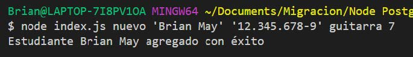
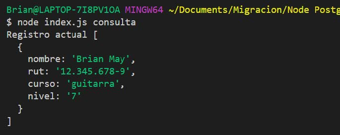
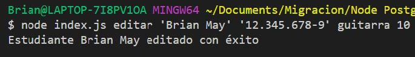
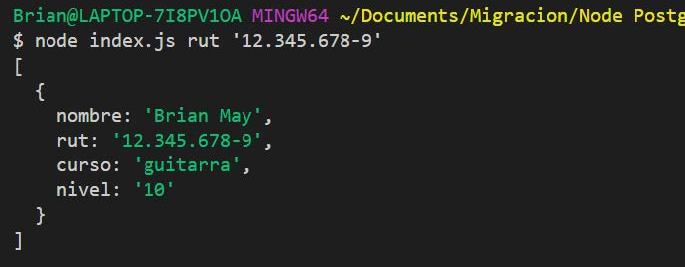
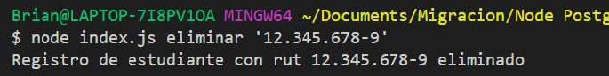

# Desafío - Always Music

## Capítulos

-  Instalación y configuración de la librería pg
-  Propiedades del objeto result y la asincronía en una consulta
-  Ingresando y consultando datos
-  Actualizando y eliminando datos

## Descripción

La escuela de música Always Music es reconocida en la ciudad por graduar a grandes músicos de reconocimiento mundial, sin embargo, a pesar de lo mucho que ha crecido con el tiempo, nunca dejaron de utilizar excel como base de datos y han decidido cambiar esto por un desarrollo personalizado.

En este desafío deberás desarrollar una aplicación en Node que realice consultas a
PostgreSQL con el paquete “pg” para:

-  Agregando un nuevo estudiante
-  Consultar los estudiantes registrados
-  Consultar estudiante por rut
-  Actualizar la información de un estudiante
-  Eliminar el registro de un estudiante

Ya que el caso se trata de un proceso de desarrollo, la interacción la debes realizar con argumentos por la línea de comandos.

Antes de iniciar este desafío deberás crear una base de datos y una tabla con las siguientes columnas:

-  Nombre
-  Rut
-  Curso
-  Nivel

Además deberás revisar la lectura titulada **Argumentos por la línea de comandos** ubicada entre los documentos de esta sesión para aprender a recibir los argumentos escritos en la ejecución de tu script.

Usa las siguientes imágenes como referencia de lo que debes lograr en el desarrollo de este desafío.

**Nuevo Estudiante**:

**Consulta**:

**Editar Estudiante**:

**Consultar por Rut**:

**Eliminar Registro de Estudiante**:

## Requerimientos

1. Crear una función asíncrona para registrar un nuevo estudiante en la base de datos. **(2 puntos)**
2. Crear una función asíncrona para obtener por consola el registro de un estudiante por medio de su rut. **(2 puntos)**
3. Crear una función asíncrona para obtener por consola todos los estudiantes registrados. **(2 puntos)**
4. Crear una función asíncrona para actualizar los datos de un estudiante en la base de datos. **(2 puntos)**
5. Crear una función asíncrona para eliminar el registro de un estudiante de la base de datos. **(2 puntos)**

## Notas

-  [x] Requerimiento 1
-  [x] Requerimiento 2
-  [x] Requerimiento 3
-  [x] Requerimiento 4
-  [x] Requerimiento 5

Requerimientos en /db/queries.js

Usa dotenv
.env subido
